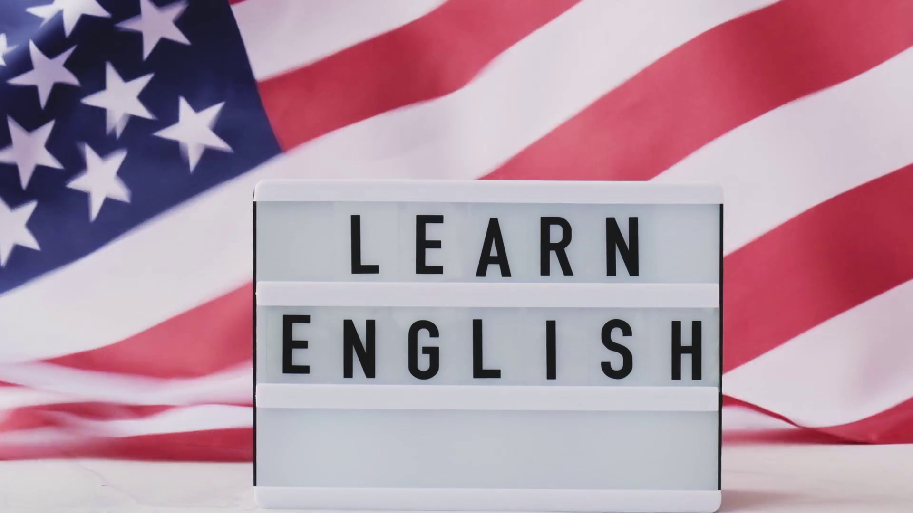

# ”Asignaturas 3DEV

## Composición y Diseño 

## Profesor: Roberto melo 

### En esta materia, estamos viendo como usar photoshop y los principios del diseño para hacer portadas de videojuegos y diseño de niveles.

<<<<<<< HEAD

=======

## Principios de Composición y Diseño 

## Profesor: Roberto Melo 

### En esta materia estamos aprendiendo un curso basico de photoshop, sus distintas herramientas para arreglar errores de una fotografia o hacer un fotomontaje.

<<<<<<< HEAD
<<<<<<< HEAD
<<<<<<< HEAD
## Diseño De videojuegos

## Profesor: Ana Guadalupe Olivar

### En esta materia estamos viendo como hacer un videojuego a detalle, la historiaa, mecanicas, mapas, ideas etc. Y vamos a adentrarnos más a lo 3D.

=======
## Ingles

## Profesor: Nancy

### En esta materia estamos tomando un curso basico de ingles para poder reforzarlo y hablar con más fluidez y ampliar nuestro vocabulario para usarlo en la vida cotidiana.

 

=======
## Programación de lenguajes interpretados

## Profesor: Jonathan Miranda 

### En esta materia estamos viendo como programar con markdown y html, al igual que estamos viendo como usar la pagina github para poder trabajr en equipo de manera efectiva.

=======
## Proyecto de app

## Profesor: Eduardo Guerrero 

### En esta materia nos  dieron a elegir si hacer una pp o videojuego en unity, y estamos viendo como crear un videojuego, desde las ideas visuales, referencias e inspiraciones de juegos antiguos.

